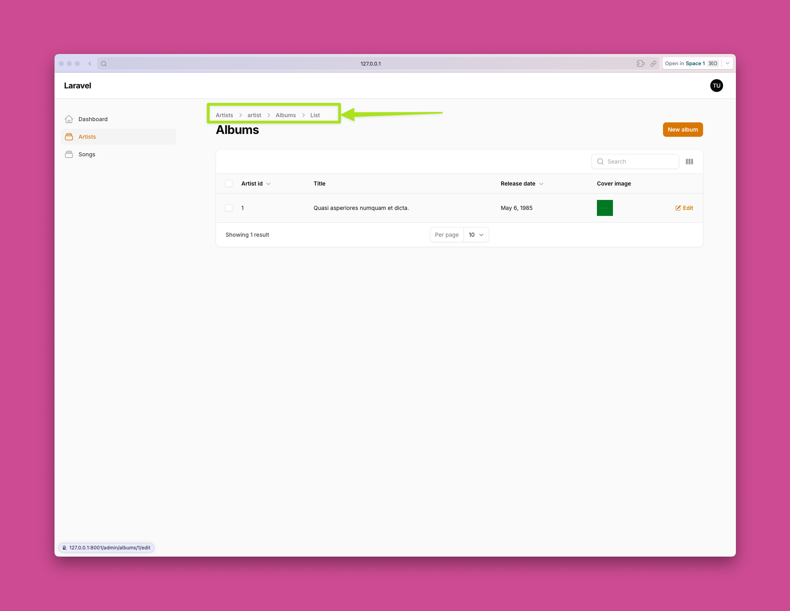

# Nested resources in Filament V3


We start from a projet with Album, Artist and Sond resources. [Check here](/repo/example-2)

We want to be able to have 1 Navigation Menu where we enter an Artist page, then navigate to their albums, and then navigate to their songs.

## The goal





## Package installation

First, install the package:

```bash frame="terminal" showLineNumbers=false
composer require saade/filament-extra
```

## Prepare parent resource: Artist

We define the Artist sub-navigation:
Now we create a link on every Artist row, to their Albums page: 

```php showLineNumbers startLineNumber=39 title="app/Filament/Resources/ArtistResource.php" ins={26-28,51-53} collapse={4-23,30-42}
    public static function table(Table $table): Table
    {
        return $table
            ->columns([
                Tables\Columns\TextColumn::make('name')
                    ->searchable(),
                Tables\Columns\TextColumn::make('country')
                    ->searchable(),
                Tables\Columns\TextColumn::make('formed_year')
                    ->sortable(),
                Tables\Columns\ImageColumn::make('image'),
                Tables\Columns\TextColumn::make('created_at')
                    ->dateTime()
                    ->sortable()
                    ->toggleable(isToggledHiddenByDefault: true),
                Tables\Columns\TextColumn::make('updated_at')
                    ->dateTime()
                    ->sortable()
                    ->toggleable(isToggledHiddenByDefault: true),
            ])
            ->filters([
                //
            ])
            ->actions([
                Tables\Actions\EditAction::make(),
                Tables\Actions\Action::make('albums')
                    ->label('albums')
                    ->url(fn($record) => ArtistResource::getUrl('album.index', ['parent' => $record->id])),
            ])
            ->bulkActions([
                Tables\Actions\BulkActionGroup::make([
                    Tables\Actions\DeleteBulkAction::make(),
                ]),
            ]);
    }

    public static function getRelations(): array
    {
        return [
            //
        ];
    }

    public static function getPages(): array
    {
        return [
            'index' => Pages\ListArtists::route('/'),
            'create' => Pages\CreateArtist::route('/create'),
            'edit' => Pages\EditArtist::route('/{record}/edit'),

            'album.index' => AlbumResource\Pages\ListAlbums::route('/{parent}/album'),
            'album.create' => AlbumResource\Pages\CreateAlbum::route('{parent}/album/create'),
            'album.edit' => AlbumResource\Pages\EditAlbum::route('{parent}/album/{record}/edit'),
        ];
    }
```

## Prepare child resource: Album

Let's configure the `AlbumResource` class, to know its parent, and to disable navigation registration on the main menu:

```php showLineNumbers startLineNumber=16 title="app/Filament/Resources/AlbumResource.php" ins={3,9}
class AlbumResource extends Resource
{
    public static ?string $parentResource = ArtistResource::class;

    protected static ?string $model = Album::class;

    protected static ?string $navigationIcon = 'heroicon-o-rectangle-stack';

    protected static bool $shouldRegisterNavigation = false;

    public static function form(Form $form): Form
```

## The Albums listing page

```php showLineNumberstitle="app/Filament/Resources/AlbumResource/Pages/ListAlbums.php" ins={8,14-18}
<?php

namespace App\Filament\Resources\AlbumResource\Pages;

use App\Filament\Resources\AlbumResource;
use Filament\Actions;
use Filament\Resources\Pages\ListRecords;
use Saade\FilamentExtra\Concerns\HasParentResource; // [!code ex2 highlight]

class ListAlbums extends ListRecords
{
    use HasParentResource; // [!code ex2 highlight]

    // (optional) Define custom relationship key (if it does not match the table name pattern). // [!code ex2 highlight]
    protected ?string $relationshipKey = 'artist_id'; // [!code ex2 highlight]

    // (optional) Define custom child page name prefix for child pages (if it does not match the parent resource slug). // [!code ex2 highlight]
    protected ?string $pageNamePrefix = 'album'; // [!code ex2 highlight]

    protected static string $resource = AlbumResource::class;

    protected function getHeaderActions(): array
    {
        return [
            Actions\CreateAction::make(),
        ];
    }
} 
```

## Demo

You can see the demo here: [Example 2](/demo/example-2)

## Extra final thougts

Lorem ipsum dolor sit amet, consectetur adipiscing elit. Cras nec rhoncus lacus, non condimentum mauris. Ut pretium ipsum massa, quis mollis turpis cursus non. Vivamus at nisl posuere, tristique tortor faucibus, volutpat risus. Mauris egestas eros orci, ac malesuada metus mattis ut. Etiam mollis consectetur tortor semper gravida. Aenean dictum lorem quam, eu rhoncus nisl sodales non. Etiam quis nibh sodales, hendrerit libero et, luctus turpis. Duis risus dui, tincidunt eget urna id, auctor vehicula augue. In quis eleifend lectus. In id quam eget ex volutpat pretium. Mauris ut justo erat.

```html blade!
<div class="w-full h-[150px] underline">Verificar source code MD. Qual o problema aqui?? O Tailwind não está a scannar content nesta diretoria.</div>
```

Lorem ipsum dolor sit amet, consectetur adipiscing elit. Cras nec rhoncus lacus, non condimentum mauris. Ut pretium ipsum massa, quis mollis turpis cursus non. Vivamus at nisl posuere, tristique tortor faucibus, volutpat risus. Mauris egestas eros orci, ac malesuada metus mattis ut. Etiam mollis consectetur tortor semper gravida. Aenean dictum lorem quam, eu rhoncus nisl sodales non. Etiam quis nibh sodales, hendrerit libero et, luctus turpis. Duis risus dui, tincidunt eget urna id, auctor vehicula augue. In quis eleifend lectus. In id quam eget ex volutpat pretium. Mauris ut justo erat.

```html blade!
<x-content.example-test />
```
Lorem ipsum dolor sit amet, consectetur adipiscing elit. Cras nec rhoncus lacus, non condimentum mauris. Ut pretium ipsum massa, quis mollis turpis cursus non. Vivamus at nisl posuere, tristique tortor faucibus, volutpat risus. Mauris egestas eros orci, ac malesuada metus mattis ut. Etiam mollis consectetur tortor semper gravida. Aenean dictum lorem quam, eu rhoncus nisl sodales non. Etiam quis nibh sodales, hendrerit libero et, luctus turpis. Duis risus dui, tincidunt eget urna id, auctor vehicula augue. In quis eleifend lectus. In id quam eget ex volutpat pretium. Mauris ut justo erat.


